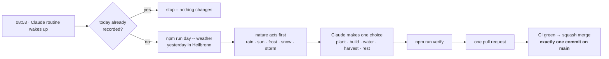
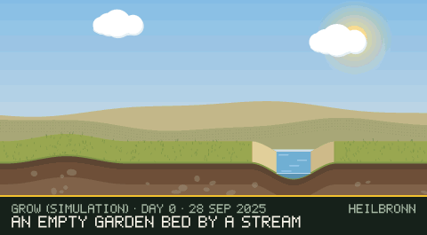
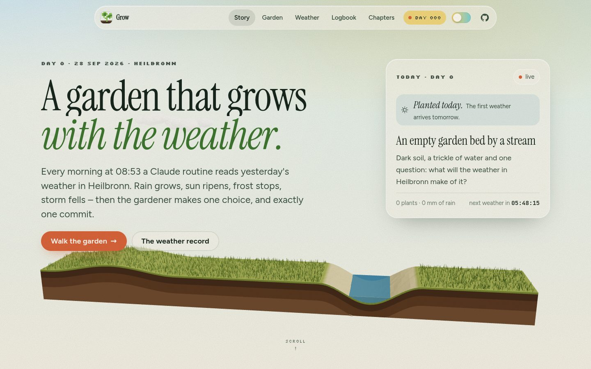
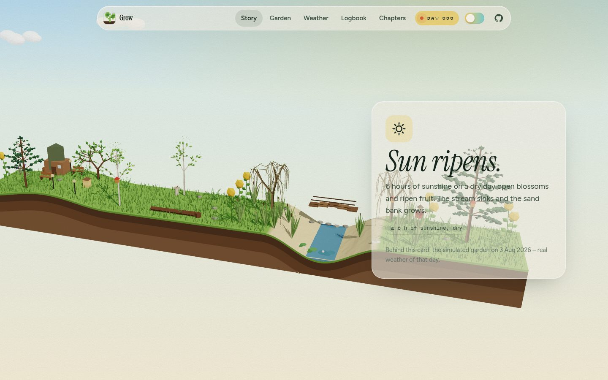
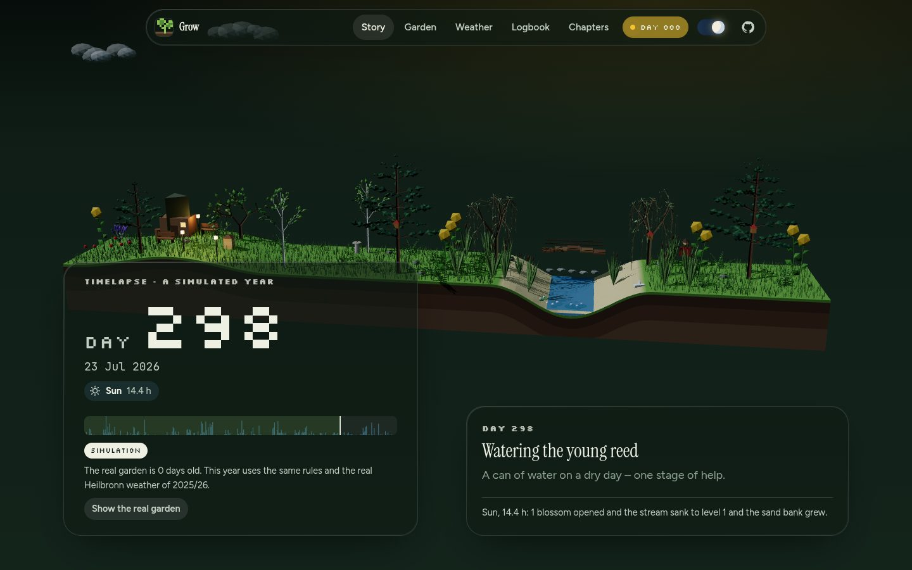
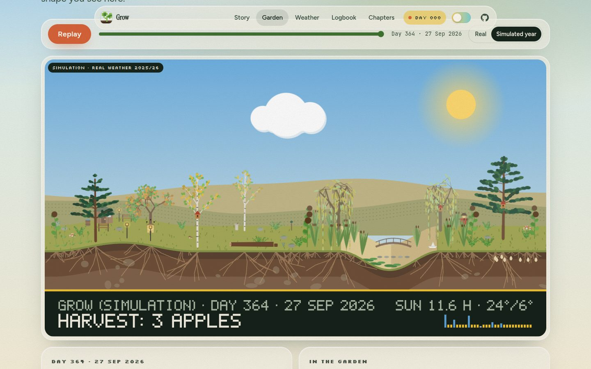
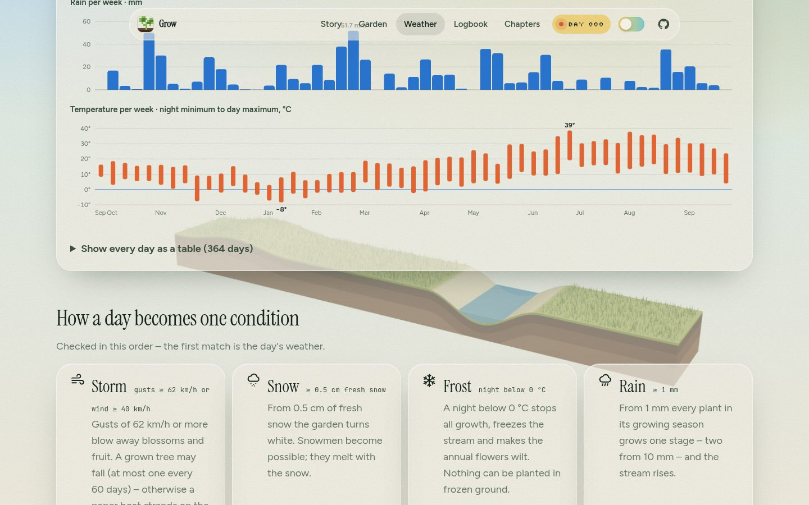
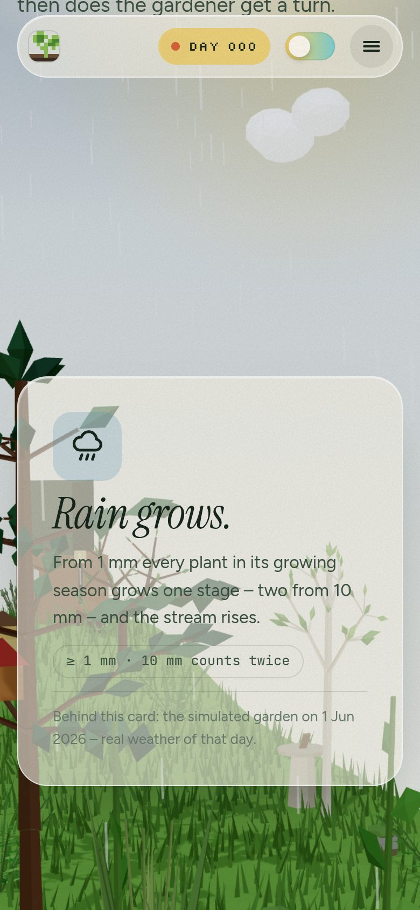

<p align="center">
  
</p>

<p align="center">
  <a href="LOGBOOK.md"></a>
  <a href="https://github.com/Fluory/Grow/blob/main/world/world.json"></a>
  <a href="ROUTINE.md"></a>
  <a href="https://github.com/Fluory/Grow/actions/workflows/ci.yml"></a>
  <a href="LICENSE"></a>
  <a href="world/LICENSE.md"></a>
</p>

**Grow** is a garden that lives in this repository and grows with the **real weather in Heilbronn**.
Every morning at 08:53 a Claude routine asks [Open-Meteo](https://open-meteo.com/) what yesterday was
like, lets that weather act on the garden – and only then makes **one** gardener's choice. The day
lands on `main` as **exactly one commit**, with the weather in its title.

> **Rain grows. Sun ripens. Frost stops. Storm fells.**

## Today in the garden

<p align="center">
  <a href="LOGBOOK.md"></a>
</p>

This picture is `world/garden.svg`, rendered from [`world/world.json`](world/world.json) by the same
commit that records the day: the sky shows yesterday's weather, the stream its level, the soil the
roots and bulbs. The newest plant is marked, the rain falls, the plants sway.

## How a day happens



| | Condition | What it does |
|---|---|---|
| 🌧️ | **Rain** ≥ 1 mm | every plant in its season grows one stage (two from 10 mm); the stream rises and widens |
| ☀️ | **Sun** ≥ 6 h, dry | blossoms open, apples ripen; the stream sinks, sand banks grow |
| 🧊 | **Frost** night < 0 °C | nothing grows, the stream freezes, annual flowers wilt |
| 🌨️ | **Snow** ≥ 0.5 cm | the garden turns white – snowmen become possible |
| 🌬️ | **Storm** gusts ≥ 62 km/h | blossoms blow away; a grown tree may fall – or a paper boat strands |
| ☁️ | **Grey** | nothing grows, nothing breaks – a good day to water |

All rules – thirteen plants, thirteen structures, what unlocks what – are in [RULES.md](RULES.md),
generated from the code that enforces them.

## Plants from grammars

Every plant is an **L-system**: a tiny grammar that rewrites itself. Each module remembers the
generation it was born in, so a tree can be shown at any *growth level* – every rain day adds a ring
of branches. The same skeleton draws the README picture and the 3D garden on the website.

<p align="center">
  
  <br><sub><b>Simulation</b> – the same rules under the real Heilbronn weather of 28 Sep 2025 – 26 Sep 2026,
  gardened by the rule-based director. The real garden starts on 28 September 2026 with an empty bed.
  A real timelapse is attached to a release every month.</sub>
</p>

## The website

A Next.js site shows the garden in 3D – one persistent WebGL canvas stays alive behind every page:
a floating slab of soil with the stream, grass that moves in the wind, L-system trees, and the
weather of the day as rain, snow and clouds. Scroll through the four rules, replay a year, explore
any day, or read the weather record (with a table view for every chart).

| | |
|---|---|
|  |  |
|  |  |
|  |  |

**Stack:** Next.js 16 (App Router, static) · React Three Fiber · GSAP + ScrollTrigger + SplitText ·
Lenis · MDX chapters · View Transitions · Open-Meteo · deployed on Vercel.

<a href="https://vercel.com/new/clone?repository-url=https%3A%2F%2Fgithub.com%2FFluory%2FGrow"></a>

## Run it yourself

```bash
npm ci
npm run dev                       # http://localhost:3000
npm run day -- status             # is today already done?
npm run day -- weather            # yesterday's weather in Heilbronn
npm run day -- plan               # what the routine sees: weather, nature, every legal choice
npm run day -- auto               # let the director garden one day locally (git restore . to undo)
npm run verify                    # format, lint, types, tests, garden check, build
```

<details>
<summary>Repository map</summary>

```text
world/world.json        the garden – day log (weather + choice) and verified snapshot
world/garden.svg        today's garden, rendered by the daily commit
LOGBOOK.md              the chronicle, newest day first (generated)
RULES.md                the rules in prose (generated from the code)
ROUTINE.md              the daily routine's instructions
src/features/garden     weather, rules, nature effects, director, replay – the engine
src/features/plants     L-system grammars, 3D turtle, growth levels
src/features/render     the garden picture (SVG)
src/features/routine    the day CLI and the Open-Meteo client
src/features/scene      the persistent 3D garden
src/app, src/features/* the website
docs/                   architecture map, project start, media
```
</details>

## The archipelago

This is one of three islands. Each grows by a different force – same routine, one commit a day.

| Island | Grows by |
|---|---|
| [**One Tile a Day**](https://github.com/Fluory/one-tile-a-day) | its own rules – a living world |
| **Grow** (this repo) | the real weather in Heilbronn – L-system plants and seasons |
| [**Wished into Being**](https://github.com/Fluory/wished-into-being) | wishes – open an issue, the most 👍 gets built |

## Transparency

The garden is **AI-maintained**. A Claude routine makes the daily choice and writes the lore; the
weather is real and recorded as measured; the code guarantees the rules; continuous integration
guards the merge. Every daily commit is co-authored by Claude. Humans change the code – in separate
pull requests, reviewed like any other project.

## Deutsch (Kurzfassung)

**Grow** ist ein Garten in diesem Repository, der mit dem echten Wetter in Heilbronn wächst. Jeden
Morgen um 08:53 Uhr holt eine Claude-Routine das Wetter von gestern (Open-Meteo): Regen lässt wachsen,
Sonne reifen, Frost stoppt, Sturm fällt. Danach trifft der Gärtner genau eine Entscheidung – ein
Commit pro Tag. Die Pflanzen sind L-Systeme, die mit jedem Regentag komplexer werden.

## License

Code: [MIT](LICENSE) · Garden (world data, images, logbook): [CC BY 4.0](world/LICENSE.md) ·
Weather data: [Open-Meteo](https://open-meteo.com/) (CC BY 4.0) · Built on the
[fluory development system](https://github.com/Fluory) – `AGENTS.md`, `docs/ARCHITEKTUR.md`.
