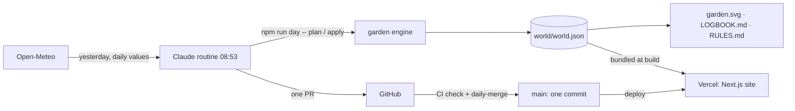

# Architecture – Grow

> Living document: whoever changes the structure changes this file **in the same PR**.
> Altitude: modules/folders, not single files. Current state – plans belong in specs.

## Summary

`world/world.json` is the single source of truth: a day log (yesterday's weather + the gardener's
one choice per day) and a snapshot of the garden that replaying the log must reproduce. A pure
TypeScript **garden engine** lets the weather act (rain grows, sun ripens, frost stops, storm fells),
checks the one choice against the rules and replays the whole log for verification. **Plants** are
parametric L-systems; one skeleton per plant feeds the **SVG renderer** (`world/garden.svg`) and the
**3D scene**. A scheduled **Claude routine** fetches the weather from Open-Meteo and drives the
engine through a CLI; CI merges its one pull request per day. A **Next.js website** shows the
garden in 3D, as a timeline explorer and as a weather record.

## Modules

| Module | Location | Responsibility | Depends on |
|---|---|---|---|
| garden | `src/features/garden/` | zod schema, weather classification, terrain, species & structures, nature effects, rules, director, apply/replay/timeline, simulate, stats | zod |
| plants | `src/features/plants/` | L-system derivation, 3D turtle, grammars, growth forms, seasonal looks | garden |
| render | `src/features/render/` | `garden.svg`: sky, hills, plants, structures, soil cross-section, caption, pixel font | garden, plants |
| logbook | `src/features/logbook/` | generated `LOGBOOK.md` and `RULES.md` | garden |
| routine | `src/features/routine/` | day CLI (`npm run day`), Open-Meteo client with cache and fallback, file IO, serialisation, PR body | garden, render, logbook |
| world-data | `src/features/world-data/` | build-time access to `world.json`, timeline, reference weather year, simulation, site constants | garden |
| scene | `src/features/scene/` | the persistent 3D canvas: soil slab, meadow, stream, L-system plants, structures, weather particles, camera rig, store | garden, plants, render (palettes), three, R3F |
| story | `src/features/story/` | home page sections and their scroll choreography of the scene | scene, weather, chapters, motion |
| explorer | `src/features/explorer/` | garden picture for any day with timeline, hover and pinning | render, scene |
| weather | `src/features/weather/` | weather icons, stat tiles, rain calendar, charts, table view | garden |
| chapters | `src/features/chapters/` + `src/content/chapters/` | MDX case studies, plant covers, MDX components | plants, render, world-data |
| chrome | `src/features/chrome/` | header, footer, theme toggle, countdown | scene |
| legal | `src/features/legal/` | imprint data from environment variables | – |
| media | `src/features/media/` | README banner, social preview, timelapse GIF (`npm run media`, monthly release workflow) | render, world-data, resvg, gifenc |
| e2e | `e2e/` | Playwright smoke flows for `verify:full` | @playwright/test |
| shared/ui, shared/motion | `src/shared/` | design primitives (grass) and motion (Lenis, SplitText, reveal) | gsap, lenis |
| app | `src/app/` | routes, layout, metadata, static JSON routes, OG image | all of the above |

Other modules import only through each module's `index.ts`.

## Exception register

Consciously accepted deviations – without an entry here a deviation is an error.

| Exception | Why accepted | Owner | Review |
|---|---|---|---|
| The routine's **daily garden PR is merged automatically** (job `daily-merge` in `ci.yml`, squash, GITHUB_TOKEN) – author and merger are both automation. | The product *is* one commit per day; a human merge every morning would break it. The job only merges same-repo `claude/*` PRs titled `Day N: …` with exactly one commit that touch only `world/world.json`, `world/garden.svg`, `LOGBOOK.md`, after the full `check` job is green. Profile: `p0_self_merge_exception` for exactly this case. | @Fluory | 2026-12-28 |
| **PR guard skipped for fork PRs.** | Outside contributors cannot fill the maintainers' German PR template; maintainers complete it before merging (CONTRIBUTING.md). | @Fluory | 2026-12-28 |
| **React-Compiler lint rules `immutability`/`refs` off in `src/features/scene/`.** | react-three-fiber mutates materials and instance buffers per frame by design; the compiler is not used. | @Fluory | at compiler adoption |

## Data flow

## External services

- **Open-Meteo** – forecast API (yesterday's daily values) for the routine; historical API (ERA5) once for the reference year. No key, CC BY 4.0 attribution on the site and in the README. The browser never calls it.
- **GitHub** – repository, Actions (CI, label sync, monthly timelapse release), pull requests.
- **Vercel** – static hosting of the website (Hobby). Imprint data as environment variables.
- **Claude routine** (Claude Code in the cloud) – runs `ROUTINE.md` daily at 08:53 Europe/Berlin.
- Sister islands (`Fluory/one-tile-a-day`, `Fluory/wished-into-being`) – their README images are fetched server-side at build time (ISR, 6 h) and inlined.

## Decisions (mini ADRs)

### ADR-1 · 2026-09-28 · One Next.js app at the repository root

- **Decision:** engine, CLI and website share one package at the root (`src/features/…`).
- **Why:** one language, one `verify`, zero-config Vercel import; the engine runs at build time and in the browser.
- **Rejected:** npm workspaces – more config for no second consumer.

### ADR-2 · 2026-09-28 · Daily change via pull request + CI squash merge

- **Decision:** the routine never writes `main`; it opens one PR, CI verifies and squash-merges it.
- **Why:** keeps "main only via PR" and the push guard intact, gives every day a reviewable record and still yields exactly one commit on `main`.
- **Rejected:** direct pushes to `main`; GitHub Actions fetching the weather and writing the garden itself (the user wanted a Claude routine).

### ADR-3 · 2026-09-28 · Event-sourced day log plus a verified snapshot

- **Decision:** `world.json` stores every day's weather and choice (inputs) *and* the resulting garden; `world:check` replays the log and requires the snapshot to match.
- **Why:** the log is the truth and makes the weather's effect reproducible; the snapshot keeps the file readable and the diff honest (rain visibly changes many plants).
- **Rejected:** snapshot only (effects not reproducible); log only (world.json unreadable without code).

### ADR-4 · 2026-09-28 · Yesterday's observed weather, repeated when unreachable

- **Decision:** the routine records the *previous* calendar day's daily values; if Open-Meteo is unreachable after three attempts, the last recorded weather is repeated with `fallback: true`.
- **Why:** yesterday is complete and observed, a forecast is a guess; the concept demands a marked fallback instead of a skipped day.
- **Rejected:** today's forecast; skipping the day; a second provider (key management for a P0 project).

### ADR-5 · 2026-09-28 · L-systems with birth levels, one skeleton for SVG and 3D

- **Decision:** every module remembers the iteration it was born in; growth shows a level (plus the next one growing in). The same skeleton is projected for the SVG and meshed for 3D.
- **Why:** "plants become more complex with every rain day" without rebuilding geometry; both views always agree.
- **Rejected:** rescaling a fixed tree (no added complexity); separate 2D and 3D generators.
